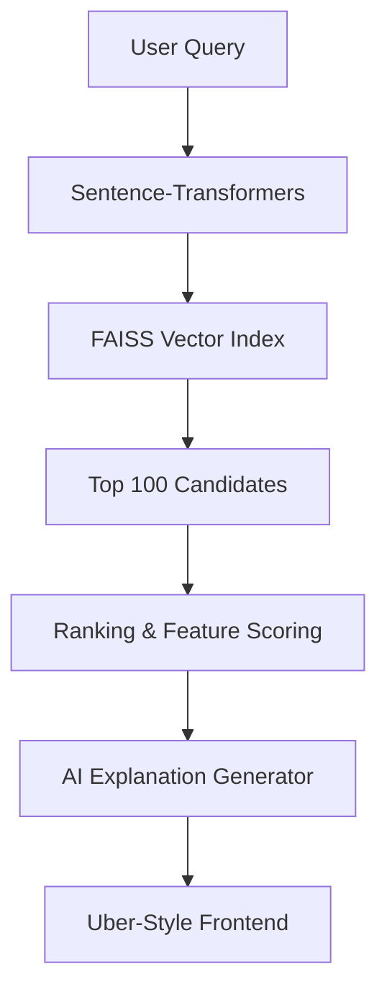

# Uber Shopping - Ranking & Recommendation Engine

[](https://fastapi.tiangolo.com/)
[](https://reactjs.org/)
[](https://sbert.net/)
[](https://github.com/facebookresearch/faiss)

A high-performance product ranking and recommendation engine inspired by Uber's Shopping architecture. It uses semantic embeddings for candidate retrieval, a multi-signal scoring function for ranking, and AI-powered explanations.

---

## 🚀 Features

- **Semantic Search**: Understands shopper intent (e.g., "cheap bluetooth speaker") using 384-dim embeddings.
- **4-Stage Ranking Pipeline**:
  1. **Retrieval**: FAISS vector similarity (top 100).
  2. **Enrichment**: Real-time feature extraction (price, popularity, rating).
  3. **Scoring**: Weighted arithmetic blending of signals.
  4. **Re-ranking**: Sorting and top-K selection.
- **AI Explanations**: Contextual reasoning for *why* an item is ranked at a specific position.
- **Recommendations**: 
  - *Similar Items*: Nearest-neighbors in embedding space.
  - *Complementary Items*: Cross-category suggestions (e.g., Laptop → Mouse).
- **Uber-Style UI**: Bold, clean, high-contrast dark theme.

---

## 🛠️ Tech Stack

- **Backend**: Python, FastAPI, FAISS, Sentence-Transformers.
- **Frontend**: React, Vite, Tailwind CSS.
- **AI Models**: `all-MiniLM-L6-v2` (Embeddings), Groq Llama 3 (Explanations).
- **Data**: 2,000 synthetic products with realistic shopping signals.

---

## 📦 Installation & Setup

### 1. Prerequisities
- Python 3.10+
- Node.js 18+

### 2. Backend Setup
```bash
# Install dependencies
pip install -r requirements.txt

# Generate data and embeddings
python scripts/generate_data.py
python scripts/build_embeddings.py

# Run server
uvicorn app.main:app --reload
```

### 3. Frontend Setup
```bash
cd frontend
npm install
npm run dev
```

### 4. Groq AI Explanations (Optional)
Create a `.env` file in the root:
```env
GROQ_API_KEY=your_key_here
```

---

## 📐 Architecture



---

## 🌐 Cloud Deployment (24/7 Hosting)

This system is optimized for **Railway** (Backend) and **Vercel** (Frontend).

### 1. Backend (Railway)
1. Link your GitHub repository.
2. Railway will detect the `Dockerfile`.
3. It will automatically build and bake the 2,000 product embeddings into the image.
4. Set the `PORT` variable to `8000` in Railway settings.
5. (Optional) Set `GROQ_API_KEY` in environment variables.

### 2. Frontend (Vercel)
1. Link your GitHub repository.
2. Select the `frontend/` directory as the root.
3. Configure the Build Command: `npm run build`.
4. Configure the Output Directory: `dist`.
5. **CRITICAL**: Add an environment variable `VITE_API_URL` pointing to your Railway backend URL (e.g., `https://recomd-engine-production.up.railway.app`).

---

## 📄 License
MIT
